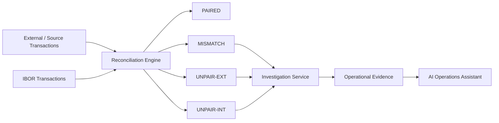
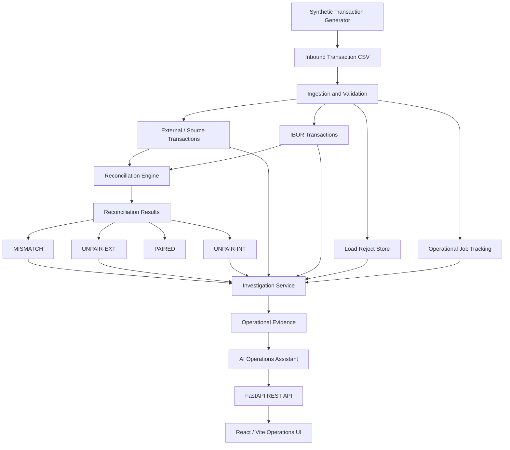
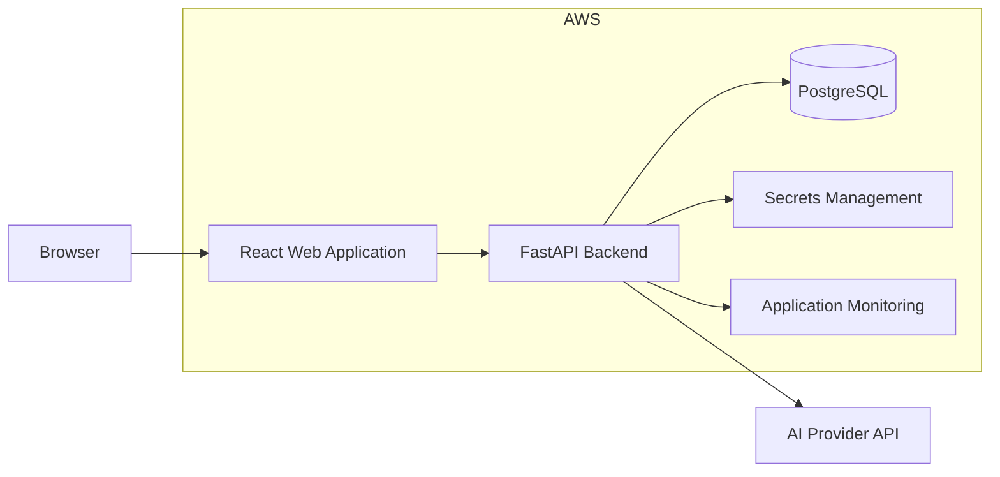

# IBOR Operations Assistant

An AI-assisted investment operations application that simulates transaction ingestion, IBOR processing, reconciliation, operational break investigation, and evidence-grounded AI analysis.

The project demonstrates how deterministic operational processing can be combined with generative AI to help investment-operations analysts investigate reconciliation exceptions while keeping operational data and reconciliation logic authoritative.

---

## Product Overview

Investment operations teams routinely need to answer questions such as:

- Did today's transaction load complete successfully?
- Which transactions failed validation?
- Are there reconciliation breaks?
- Is a transaction missing externally or internally?
- Which values differ for a mismatched transaction?
- Was a missing IBOR transaction caused by an ingestion reject?
- What evidence should an analyst review before replaying a transaction?
- Which accounts or securities have reconciliation exceptions?

IBOR Operations Assistant brings these workflows together in a single full-stack application.

The application:

1. Generates synthetic transaction data.
2. Validates and ingests external transactions.
3. Simulates an IBOR transaction store.
4. Performs deterministic transaction reconciliation.
5. Classifies reconciliation results.
6. Collects operational evidence for reconciliation breaks.
7. Provides deterministic break investigation.
8. Uses an AI assistant to explain operational evidence.
9. Provides a React-based operations dashboard for investigation.

---

# Key Capabilities

## Transaction Ingestion

Synthetic transaction files are processed through a validation and ingestion pipeline.

Account and security references are validated before transactions are persisted.

Invalid records are captured in an operational reject store instead of silently failing.

Each ingestion execution is tracked as an operational job with:

- Run ID
- Business date
- Input record count
- Successful record count
- Rejected record count
- Processing status
- Start and completion timestamps

Supported job statuses include:

- `SUCCESS`
- `PARTIAL`
- `FAILED`

---

## Transaction Reconciliation

The reconciliation engine compares external/source transactions with their IBOR equivalents.

Results are classified into four reconciliation states:

| Status | Meaning |
|---|---|
| `PAIRED` | External and IBOR transactions exist and reconciled values match |
| `MISMATCH` | Both transactions exist but one or more reconciled values differ |
| `UNPAIR-EXT` | External transaction exists but the corresponding IBOR transaction is missing |
| `UNPAIR-INT` | IBOR transaction exists but the corresponding external transaction is missing |

The reconciliation status is determined by deterministic application logic rather than by the AI model.

---

# Reconciliation Flow



---

# Operational Investigation

Reconciliation determines **what broke**.

The investigation service gathers additional operational evidence to help determine **why the break may have occurred**.

For each reconciliation break, the application can retrieve:

- Reconciliation record
- External/source transaction
- IBOR transaction
- Matching ingestion reject
- Latest ingestion job
- Quantity comparison
- Amount comparison
- Root-cause evidence
- Recommended investigation action

The investigation service operates independently of the AI model.

---

## MISMATCH Investigation

For a `MISMATCH`, both transactions exist but one or more values differ.

The application calculates:

- External quantity
- IBOR quantity
- Quantity difference
- External amount
- IBOR amount
- Amount difference

Example:

```text
External Quantity: 100
IBOR Quantity:      105
Difference:          -5

External Amount: 10000
IBOR Amount:      10500
Difference:        -500
```

The analyst can then investigate which system contains the correct value before correcting or replaying the transaction.

---

## UNPAIR-EXT Investigation

`UNPAIR-EXT` means:

```text
External transaction exists
            +
IBOR transaction does not exist
```

The investigation service checks whether a corresponding ingestion reject exists.

If a matching reject is found, the analyst can review the reject reason.

If no matching reject exists, the analyst can investigate the interface or ingestion processing path.

---

## UNPAIR-INT Investigation

`UNPAIR-INT` means:

```text
IBOR transaction exists
            +
External transaction does not exist
```

Possible investigation paths include:

- Internally generated transaction
- Delayed external feed
- Incorrect transaction identifier
- Missing external transaction
- Interface timing differences

The application does not claim one of these possibilities as the root cause unless supporting evidence exists.

---

# Evidence-Grounded AI Operations Assistant

A core design principle of the application is:

> **AI explains operational evidence. It does not determine operational truth.**

The AI assistant operates only after deterministic evidence has been collected.

```text
Database
   |
   v
Reconciliation Logic
   |
   v
Investigation Service
   |
   v
Operational Evidence
   |
   v
AI Operations Assistant
   |
   v
Analyst-Friendly Explanation
```

The database and application reconciliation logic remain authoritative.

---

## AI Guardrails

The AI assistant is instructed not to:

- Invent transactions
- Invent ingestion rejects
- Invent system failures
- Invent account activity
- Change deterministic reconciliation status
- Claim a transaction was rejected without matching reject evidence
- Treat a `PARTIAL` ingestion job as proof that a particular transaction failed
- Present an unconfirmed root cause as confirmed
- Recommend transaction replay without considering available evidence

When evidence is insufficient, the assistant should explicitly state that the root cause is not confirmed.

---

# AI Investigation Modes

The application supports two AI investigation scopes.

## Selected Break

The analyst can select an individual reconciliation break and ask questions about that record.

Example:

```text
Why did this transaction mismatch?
```

```text
Was this transaction rejected during ingestion?
```

```text
What values differ between the external and IBOR transactions?
```

```text
What should operations investigate next?
```

The assistant receives detailed evidence for that reconciliation record.

---

## Full Reconciliation Run

The analyst can also ask questions across an entire reconciliation run.

Example:

```text
Summarize the reconciliation failures.
```

```text
Which accounts have reconciliation breaks?
```

```text
How many MISMATCH and UNPAIR transactions occurred?
```

```text
Which securities are affected?
```

The application retrieves reconciliation evidence before sending context to the AI model.

---

# Application Architecture



---

# Logical Processing Architecture

```text
                   IBOR OPERATIONS ASSISTANT

                           React UI
                              |
                              v
                         FastAPI API
                              |
          +-------------------+-------------------+
          |                   |                   |
          v                   v                   v
      Ingestion         Reconciliation       Investigation
       Service             Service              Service
          |                   |                   |
          |                   |                   v
          |                   |              Evidence Layer
          |                   |                   |
          |                   |                   v
          |                   |            AI Assistant
          |                   |
          +-------------------+-------------------+
                              |
                              v
                         PostgreSQL
```

---

# Technology Stack

## Backend

- Python
- FastAPI
- Pydantic
- Psycopg
- OpenAI API

## Database

- PostgreSQL 17

## Frontend

- React
- Vite
- JavaScript
- CSS

## Infrastructure / Development

- Docker
- Docker Compose
- REST APIs
- Git
- GitHub

---

# Repository Structure

```text
ibor-operations-assistant/
|
├── app/
│   ├── main.py
│   ├── config.py
│   │
│   ├── api/
│   │
│   ├── db/
│   │   └── connection.py
│   │
│   ├── generator/
│   │   └── generate_data.py
│   │
│   └── services/
│       ├── ingestion.py
│       ├── reconciliation.py
│       ├── investigation.py
│       └── ai_assistant.py
│
├── data/
│   └── inbound/
│
├── sql/
│   ├── 001_schema.sql
│   └── 002_seed_reference.sql
│
├── ui/
│   ├── public/
│   ├── src/
│   │   ├── App.jsx
│   │   ├── App.css
│   │   ├── index.css
│   │   └── main.jsx
│   ├── package.json
│   └── vite.config.js
│
├── docs/
│   ├── screenshots/
│   └── diagrams/
│
├── docker-compose.yml
├── requirements.txt
├── .env.example
├── .gitignore
└── README.md
```

---

# Local Development

## Prerequisites

Install:

- Python 3.11+
- Docker Desktop
- Node.js / npm
- Git

---

# 1. Start PostgreSQL

Start the local PostgreSQL container:

```bash
docker compose up -d
```

Verify the container:

```bash
docker compose ps
```

The database is exposed on:

```text
localhost:5433
```

The non-default port avoids conflicts with a locally installed PostgreSQL instance using port `5432`.

---

# 2. Configure Python

Create a Python virtual environment:

```bash
python3 -m venv .venv
```

Activate it:

```bash
source .venv/bin/activate
```

Install dependencies:

```bash
pip install -r requirements.txt
```

Create the local environment file:

```bash
cp .env.example .env
```

Configure required local values in `.env`.

The `.env` file is excluded from Git and should never contain credentials intended for source control.

---

# 3. Generate Synthetic Transaction Data

Generate a standard transaction dataset:

```bash
python -m app.generator.generate_data --count 30 --scenario normal
```

A mixed scenario can be used to demonstrate reconciliation exceptions:

```bash
python -m app.generator.generate_data --count 30 --scenario mixed
```

The generated file is written to:

```text
data/inbound/transactions.csv
```

Generated transaction files are excluded from Git.

---

# 4. Start FastAPI

Start the backend:

```bash
uvicorn app.main:app --reload --port 8000
```

Swagger API documentation is available locally at:

```text
http://127.0.0.1:8000/docs
```

---

# 5. Health Check

```bash
curl http://127.0.0.1:8000/health
```

Expected response:

```json
{
  "status": "ok"
}
```

---

# 6. Reset Demo Data

Reset operational demo data:

```bash
curl -X POST http://127.0.0.1:8000/demo/reset
```

Example response:

```json
{
  "status": "SUCCESS",
  "message": "Demo operational data reset successfully"
}
```

---

# 7. Ingest Transactions

```bash
curl -X POST http://127.0.0.1:8000/ingest
```

Example:

```json
{
  "run_id": "example-run-id",
  "status": "PARTIAL",
  "input_count": 30,
  "success_count": 27,
  "reject_count": 3
}
```

---

# 8. Run Reconciliation

```bash
curl -X POST http://127.0.0.1:8000/reconcile
```

The reconciliation engine produces results such as:

```text
PAIRED
MISMATCH
UNPAIR-EXT
UNPAIR-INT
```

---

# 9. View Reconciliation Breaks

```bash
curl http://127.0.0.1:8000/recon/breaks
```

Only non-paired reconciliation records are returned.

---

# 10. Deterministically Investigate a Break

Example:

```bash
curl http://127.0.0.1:8000/recon/breaks/25
```

This endpoint performs deterministic investigation without invoking the AI model.

The response can include:

- reconciliation status
- source transaction
- IBOR transaction
- matching ingestion reject
- ingestion job
- value comparison
- root-cause evidence
- recommended action

---

# 11. AI-Assisted Break Investigation

```bash
curl -X POST \
  http://127.0.0.1:8000/assistant/investigate/25
```

The application first gathers operational evidence and then asks the AI model to explain that evidence.

---

# 12. Conversational Operations Assistant

Example:

```bash
curl -X POST \
  http://127.0.0.1:8000/assistant/chat \
  -H "Content-Type: application/json" \
  -d '{
    "question": "Summarize the reconciliation failures",
    "scope": "all",
    "history": []
  }'
```

Selected reconciliation record:

```json
{
  "question": "Why did this transaction mismatch?",
  "scope": "selected",
  "recon_id": 25,
  "history": []
}
```

---

# 13. Start the React UI

Open another terminal:

```bash
cd ui
```

Install dependencies:

```bash
npm install
```

Start the development server:

```bash
npm run dev
```

The React development UI normally runs at:

```text
http://localhost:5173
```

---

# API Overview

| Method | Endpoint | Purpose |
|---|---|---|
| `GET` | `/health` | Application and database health check |
| `POST` | `/demo/reset` | Reset demo operational data |
| `POST` | `/ingest` | Ingest synthetic transaction file |
| `POST` | `/reconcile` | Execute transaction reconciliation |
| `GET` | `/recon/breaks` | Retrieve reconciliation exceptions |
| `GET` | `/recon/breaks/{recon_id}` | Deterministically investigate a reconciliation break |
| `POST` | `/assistant/investigate/{recon_id}` | Generate AI-assisted explanation for a break |
| `POST` | `/assistant/chat` | Conversational reconciliation assistant |
| `GET` | `/jobs/latest` | Retrieve latest ingestion jobs |
| `GET` | `/rejects` | Retrieve ingestion rejects |
| `POST` | `/demo/unpair-ext` | Create a demo UNPAIR-EXT condition |

---

# Database Flow

```text
Inbound Transaction File
           |
           v
      IBOR_JOB_RUN
           |
           +------ Invalid ------> IBOR_LOAD_REJECT
           |
           v
   SOURCE_TRANSACTION
           |
           v
    IBOR_TRANSACTION
           |
           v
 IBOR_TXN_RECON_RECORD
           |
     +-----+-----+----------+
     |           |          |
     v           v          v
   PAIRED    MISMATCH    UNPAIRED
                         /       \
                        v         v
                  UNPAIR-EXT  UNPAIR-INT
```

---

# Demo Scenarios

The synthetic data generator supports scenarios used to demonstrate operational behavior.

Examples include:

- Normal transactions
- Invalid accounts
- Duplicate transactions
- Mismatched transaction values
- External-only transactions
- IBOR-only transactions
- Mixed reconciliation scenarios

These scenarios make it possible to demonstrate operational investigation without using production data.

---

# Application Demo

A short application demo can cover the complete lifecycle:

```text
Generate Synthetic Transactions
            |
            v
        Ingestion
            |
            v
      Job Monitoring
            |
            v
       Reconciliation
            |
            v
       Review Breaks
            |
            v
       Select Break
            |
            v
 Deterministic Investigation
            |
            v
     AI Explanation
            |
            v
 Recommended Investigation
```

Recommended video flow:

1. Show the application dashboard.
2. Generate or reset synthetic demo data.
3. Run transaction ingestion.
4. Review ingestion status.
5. Run reconciliation.
6. Display `MISMATCH`, `UNPAIR-EXT`, and `UNPAIR-INT`.
7. Select an individual reconciliation break.
8. Review deterministic evidence.
9. Ask the AI assistant to explain the break.
10. Ask the assistant to summarize all reconciliation failures.

Screenshots and a demo video can be linked from this repository.

---

# Target Cloud Architecture

The application can be deployed to AWS while retaining the same logical architecture.



A possible AWS implementation could use:

```text
React / Vite
     |
     v
AWS Amplify
or
S3 + CloudFront
     |
     v
FastAPI Container
     |
     v
AWS App Runner / ECS
     |
     +------------------+
     |                  |
     v                  v
Amazon RDS        Secrets Manager
PostgreSQL
     |
     v
CloudWatch
```

The cloud architecture can evolve as the project grows.

---

# Cloud Deployment Goals

Future cloud deployment can provide:

- Public HTTPS frontend
- Secured REST API
- Managed PostgreSQL database
- Managed application secrets
- Centralized logging
- Health monitoring
- CI/CD from GitHub
- Containerized backend deployment
- Environment-specific configuration

Demo and administrative endpoints should be protected before exposing the application publicly.

---

# Security and Data Handling

The application uses synthetic data for development and demonstration.

The repository should not contain:

- Production transaction data
- Confidential client or employer information
- Proprietary schemas
- Credentials
- API keys
- Local `.env` files
- Production database passwords
- Internal enterprise documentation

Secrets should be provided using environment variables or managed secret storage.

---

# Design Principles

The project follows several important engineering principles.

## Deterministic Processing First

Operational status is calculated by application logic.

AI does not determine whether a transaction is paired, mismatched, or unpaired.

## Evidence Before Explanation

Operational evidence is collected before the AI model is invoked.

## Explainability

The analyst can inspect the underlying transactions, reconciliation record, job information, and reject evidence.

## Controlled AI

The AI assistant receives explicit instructions to avoid inventing operational facts.

## Separation of Concerns

The application separates:

```text
Ingestion
    |
Reconciliation
    |
Investigation
    |
AI Explanation
    |
Presentation
```

This allows each layer to evolve independently.

---

# Future Enhancements

Potential extensions include:

### Investment Operations

- Position reconciliation
- Cash reconciliation
- Tax-lot reconciliation
- Position snapshots
- BOD/EOD processing
- Cash-flow processing
- Position promotion simulation

### Reconciliation Analytics

- Break aging
- Historical reconciliation trends
- Account-level break analytics
- Security-level break analytics
- Break severity
- SLA monitoring

### AI Operations

- Operational document retrieval
- Runbook integration
- SQL diagnostic assistance
- Historical break analysis
- Suggested remediation workflows
- Investigation audit trail

### Platform Engineering

- Authentication and authorization
- Role-based access
- API rate limiting
- Automated tests
- CI/CD pipeline
- Containerized backend
- Cloud deployment
- Application monitoring
- Centralized logging

---

# Project Roadmap

```text
Transaction Ingestion
        |
        v
Transaction Reconciliation
        |
        v
Break Investigation
        |
        v
AI Operations Assistant
        |
        v
Position / Cash / Tax Lot Reconciliation
        |
        v
Operational Analytics
        |
        v
Cloud Deployment
        |
        v
Automated Operations Workflows
```

---

# Disclaimer

This project is an independent educational and portfolio project built using synthetic data for learning, demonstration, and technical showcase purposes.